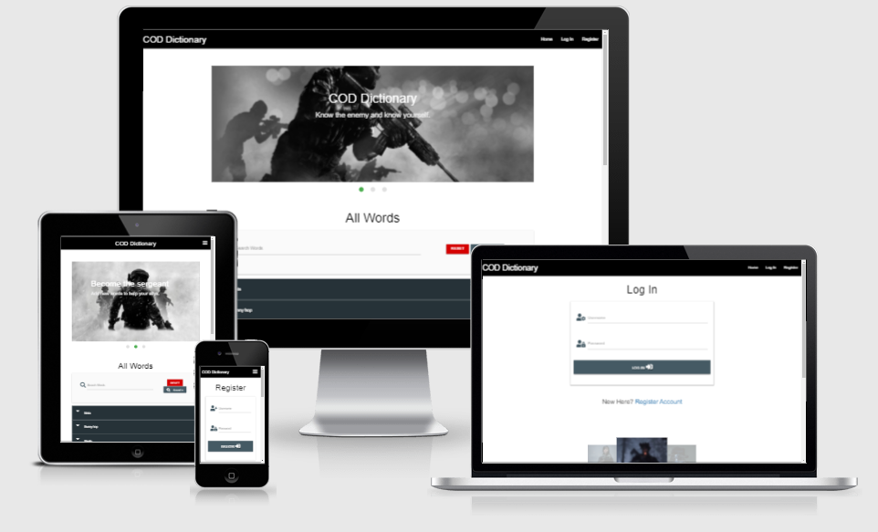
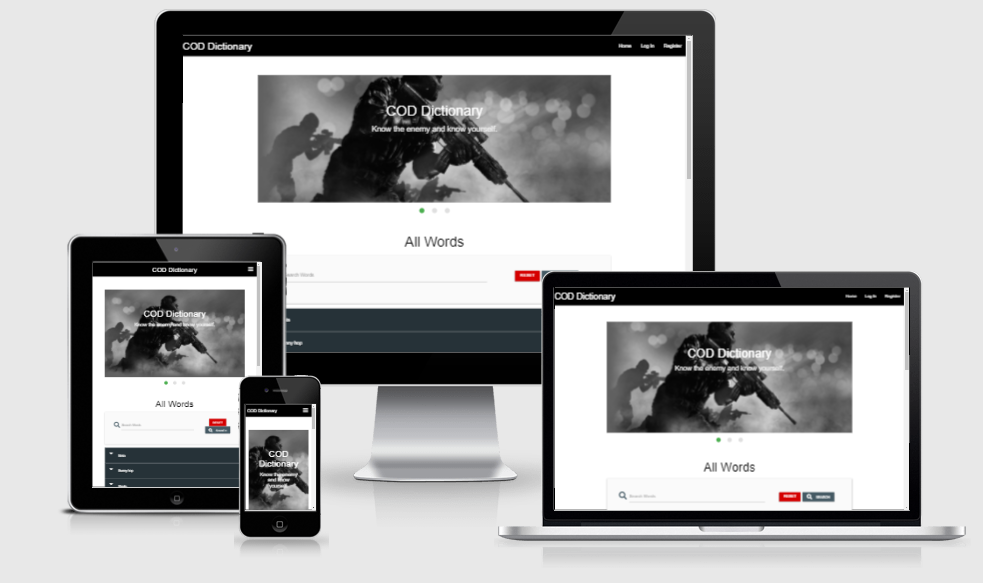
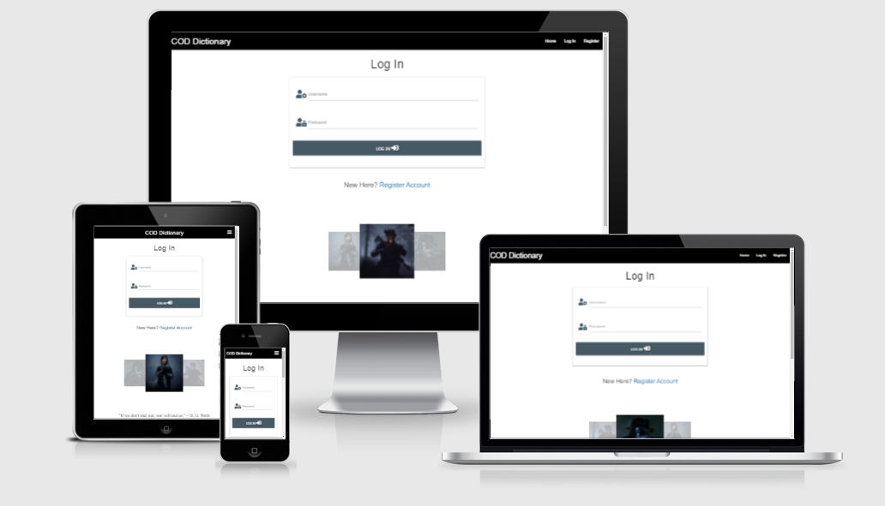
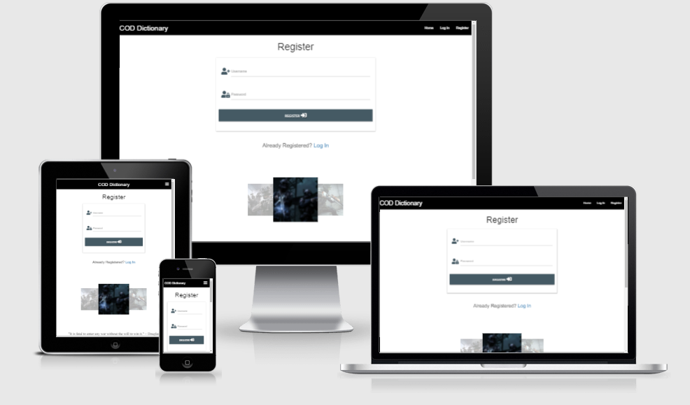
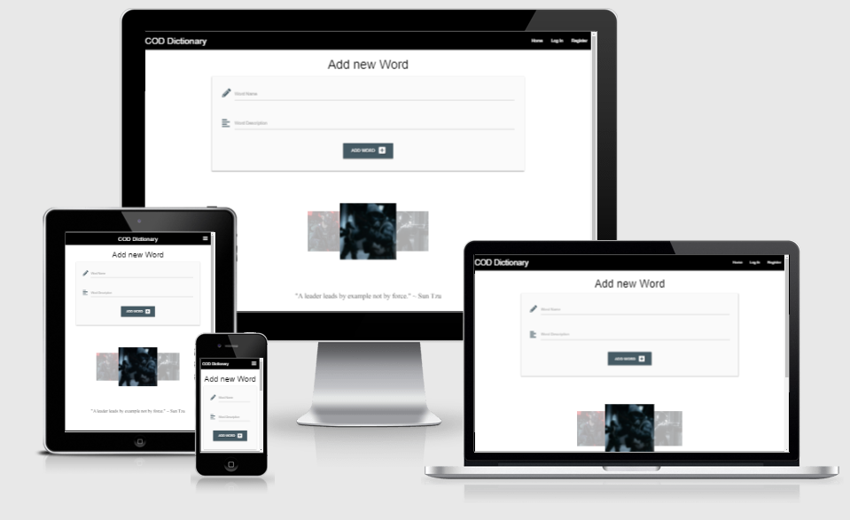

# Milestone project 3: Building a jargon glossary/dictionary for a particular domain named COD Dictionary

[Link to Live Website](https://adz-dictionary.herokuapp.com/)

[GitHub Repo](https://github.com/adilkhr/my-ms3-project)

***

## The purpose of the project

* To create an applicaition for users to look for defintiions in regards to the game Call Of Duty warzone and understand what terms mean in the game, and also to allow users to create an account for them to create their own definitons for new words and to be able to then update the site aswell as being able to delete their definitions if they arent happy with it. For Data handling, i will be using MongoDB and flask to achieve the Data handling aspect of the application, aswell as using HTML and custom CSS for the website's front-end.

***

## User Experience (UX)

## Strategy

### User Stories

#### First time visitor goals:

As a new user:

* I am looking to understand what certain words/terms mean for the game
* I want the site to be very easy to navigate aswell as being able to use it on other devices aswell
* I would like to be able to create account for the applicaiton to add new definitions

#### Visting User goals:

* As a user, i want to be able to sign up to add new defintions for words for others to see and understand what it means
* As a user, when signing up i would like to have a profile portal that is fully functional and working
* As a user, i want to be able to update defintions of words aswell having the option to delete

#### Reasons for the website:

* To allow people who play call of duty to understand what terms that are used in the game mean 
* To allow experienced players to share new words/terms into the dictionary

## Scope
#### What a user may expect:

* Easy to navigate application
* A site that is visually appealing on all devices
* An option to register an account
* A search option to find a specific word/term that they have heard about while playing the game
* A log in feature to log in an add a new word to the dictionary

#### What a user may want:

* An option to edit a word (once they have created an account) that they have added into the dictionary if they feel like they can improve the meaning of it
* An option to delete a word (once they have created an account) that they added into the dictionary
* A access link to the official call of duty website

#### As a developer / business I expect:

* To provide an easy feature for users to register an account
* To provide an easy login page for users to log in once they have succesfully created their account
* To allow registered users to create new words with the definition and add them to the dictionary
* To also allow registered users to only have the choice wether or not they would like to delete or edit their words in the dictionary

## Structure

The website will consits of 3 pages for users that have not logged in,

* A home page which will contain the defintion of words aswell as having search bar, it will also contain some messages for users to understand why the website was designed
* A log in page for users to log in if they have created an account
* A Register page for users who dont have an account can register

The website will consits of 4 pages for users that have an account and are logged in,

* Again, a home page which will contain the defintion of words aswell as having search bar, it will also contain some messages for users to understand why the website was designed
* A profile page which will display the users name to know that they are currently logged in
* An add word paged which will allow the logged in user to add a word into the dictionary
* A logout option for users to log out once they are finished using the site

Also if a user is logged in and have added words into the dictionary they will be able to delete or edit the word at the home page, when clicking the edit button, they will be directed to a new page to edit the word and update the definiton along with the word.

***

## Features

### Navigation Bar:

The navigation bar will be simple black and white,easy to use with the name of COD Dictionary which will have a home, log in and register pages for new users and users who are not logged in. When users log in, it will have a home, profile addwords and a logout link. On smaller devices I have used a dropdown button to display the menu to make it fully responsive.

### Footer:

The footer will contain social media links for users to browse and connect with the site makers. The footer will have an about us section explaining more about the site. The footer will also contain a link to the offical call of duty page.

### Home:

Home page will include an image sliders that will present text to make it visually appealing for all users. It will also contain the word definitions that registerd users create with only them being able to edit and delete any words that they have created. It will also contain a search bar for users to search for words with in the dictionary. There will also be a message for users that will direct them to the register page if they would like to add a new word into the dictionary.

### Log in page:

A log in page for users who have already registered in the past to access their account by inputing their username and password into log in form. It will also contain a carousel slide of images along with a quote underneath it.

### Register page:

A register page for new users to fill in the register form by inputting a username of their choice aswell as a password. It will also contain a carousel slide of images along with a quote underneath it.

### Profile page:

A profile page for users once they log in will be prompted this page with their username showing aswell as a welcome image and welcome text. It will also have a link for the user to be directed to the add words page.

### Add words page:

A page for users to add a new word with a definiton to the dicitionary for other users to see when they access the home page of the site. It will also contain a carousel slide of images along with a quote underneath it.

### Log out:

An option for users who are logged in to log out once they are finished using the site.

### 

***

## Future Features 

A future feature that I would like to add to my website would be more customisable features for users who have an account on their profile page. This would be great for users as they will enjoy using the site even more and will possibly use the site even longer.

***

## Skeleton

### Wireframes:

Note: Wireframes for the desktop share similar strucuture for tablet

* Wireframes for desktop have been created and can be viewed [here](https://github.com/adilkhr/my-ms3-project/blob/main/wireframes/wireframesms3desktop.pdf)

* Wireframes for mobile phone have been created and can be viewed [here](https://github.com/adilkhr/my-ms3-project/blob/main/wireframes/wireframesms3phone.pdf)

### Mockup:

***

## Typography and color scheme

* For Typography I used google fonts to then apply the oswald font all round the site, and i also used the font-family of Bona Nova for the quotes i have added on some of my pages
* The colour scheme used throughout the page were mainly white, black, and grey/blue grey. I kept the colour theme to a minimum as i felt there was no need to overcomplicate the site as it may distract users from the content and would not look visually appealing. Using materialize css throughout my project i used the color pallete to pick the colors used in my site, using the following: black, blue-grey darken 4, blue-grey darken 2 and blue-grey darken 1

***

## Technonologies Used

* The Languages used to code my project were HTML5 to create the Mark-up language using sematic structure, and CCS3 for the Cascading style sheet used to style the content look visually appealing, javscript to add some animations and function to certain elements on my site
* I used python to control the backend code and actions of my project
* I used fontawesome icon links in my pages to add specific icons to my page to make it look appealing and not dull and boring
* I used materialize css to create sections of the pages so that it would be resonsive for majority of screens  
* I used Github to host the repository and Gitpod.io to write the code, and using the command line for committing and pushing the code to Github
* I used mongodb to store my database and use it for the site
* I used flask framework
* I used GIT for version control of the project
* I used Balsamiq wireframes to create wireframes for my site
* I used heroku to deploy and host my live site

***

